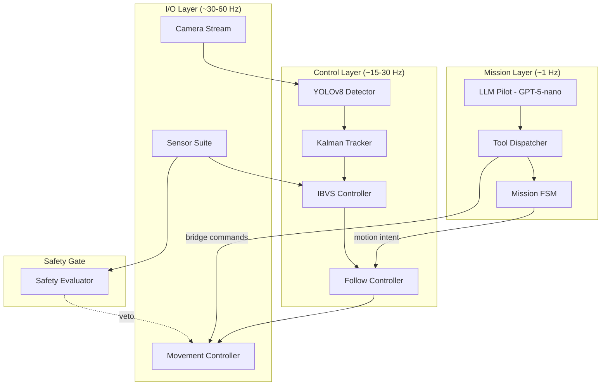
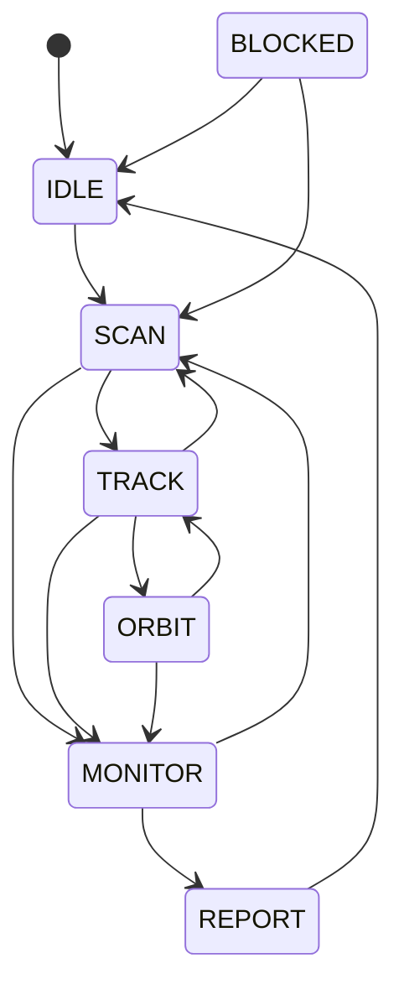

# Architecture Guide

This document provides an in-depth look at the SkyTrackVision system architecture, data flow, and design decisions.

## Layered Architecture

SkyTrackVision follows a strict **three-layer architecture** where each layer operates at a different frequency:



## Data Flow

### Per-Frame Pipeline

```
AirSim Camera → FramePacket → YOLOv8 → Detection[] → KalmanTracker → TrackedTarget
                                                                           ↓
AirSim Sensors → SensorSnapshot ─────────┬───→ SafetyEvaluator → SafetyEvaluation
                                          │                              ↓
                MissionFSM → MotionIntent → IBVS Controller → VelocityCmd → AirSim
```

### Contract Types

All data between layers flows through **typed dataclass contracts** defined in `autonomy/contracts.py`:

| Contract | Purpose |
|----------|---------|
| `FramePacket` | Camera frame with metadata |
| `Detection` | Single YOLO detection with class, bbox, track ID |
| `TrackedTarget` | Smoothed target with Kalman state, confirmation status |
| `SensorSnapshot` | LiDAR + proximity + telemetry at one point in time |
| `SafetyEvaluation` | Safety verdict: allowed directions, blocked reasons |
| `MotionIntent` | FSM output: what primitive to execute (FOLLOW, SCAN, HOVER) |
| `VelocityCmd` | Final velocity command sent to AirSim |
| `MissionContext` | High-level mission state for the LLM |
| `MissionReport` | End-of-mission telemetry summary |

## Mission FSM

The Finite State Machine is the **single source of truth** for mission state:



Invalid transitions raise `InvalidTransitionError`. The FSM includes timeout-based recovery: if a state exceeds its maximum duration, it auto-transitions to a safe fallback.

## Safety Gate

The `SafetyEvaluator` is a **deterministic, non-overridable gate** between the control layer and AirSim:

```python
# This is enforced in AirSimBridge — the LLM cannot bypass it
evaluation = safety.evaluate(snapshot, connection_ok)
if not evaluation.allow_forward:
    cmd.vx = max(cmd.vx, 0)  # Block forward motion
if not evaluation.allow_descent:
    cmd.vz = max(cmd.vz, 0)  # Block descent
```

### Safety States

| State | Trigger | Effect |
|-------|---------|--------|
| `PATH_CLEAR` | All sensors nominal | No restrictions |
| `OBSTACLE_AHEAD` | Front proximity < threshold | Block forward movement |
| `OBSTACLE_CLUSTER` | LiDAR clusters > threshold | Block forward movement |
| `ALTITUDE_LOW` | Altitude < minimum | Block descent |
| `LANDING_CAUTION` | Low altitude during descent | Reduce descent speed |
| `SAFETY_OVERRIDE` | Connection lost / sensors unavailable | Block all movement |
| `REPOSITION_SUGGEST` | Marginal conditions | Suggest lateral reposition |

## IBVS Controller

The Image-Based Visual Servoing controller uses a **cascade PID** design:

```
                    ┌──────────────┐
 pixel error x ───→│  Yaw PID     │───→ yaw_rate
                    └──────────────┘
                    ┌──────────────┐     ┌──────────────┐
 area error   ───→ │  Forward PID │───→ │  Vx Inner PID │───→ vx
                    └──────────────┘     └──────────────┘
                    ┌──────────────┐     ┌──────────────┐
 pixel error y ───→│  Altitude PID│───→ │  Vz Inner PID │───→ vz
                    └──────────────┘     └──────────────┘
```

Features:
- **Derivative low-pass filter** — first-order IIR to suppress sensor noise
- **Anti-windup** — integral halved on error sign change to prevent overshoot
- **Output clamping** — configurable max velocities per axis

## LLM Tool Dispatch

The SkyPilot uses OpenAI function calling to control the drone. Available tools:

| Tool | Description |
|------|-------------|
| `request_takeoff` | Arm and take off |
| `request_land` | Land at current position |
| `request_move_to_altitude` | Move to specific altitude |
| `request_scan` | Begin scanning (transition to SCAN) |
| `request_follow` | Lock and follow target (transition to TRACK) |
| `request_return_home` | Return to takeoff position |
| `request_hover` | Stop and hover in place |
| `set_mission_state` | Direct FSM transition (with BFS path resolution) |
| `wait_seconds` | Pause execution for N seconds |
| `get_telemetry` | Read current sensor data |
| `get_mission_report` | Generate mission summary |
| `complete_mission` | End the mission |

### BFS State Path Resolution

When the LLM requests a state that's not directly reachable (e.g., TRACK → REPORT), the `ToolDispatcher` uses BFS to find the shortest valid path through the FSM graph and executes each intermediate transition automatically.
