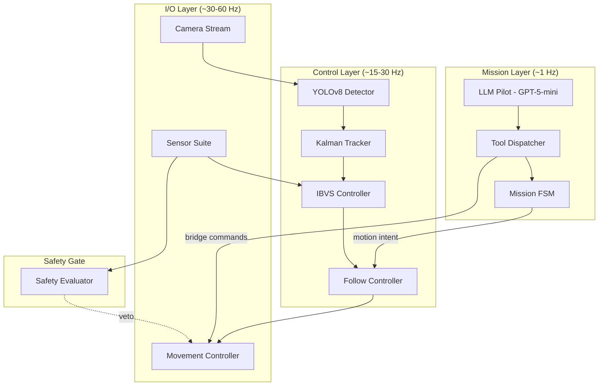
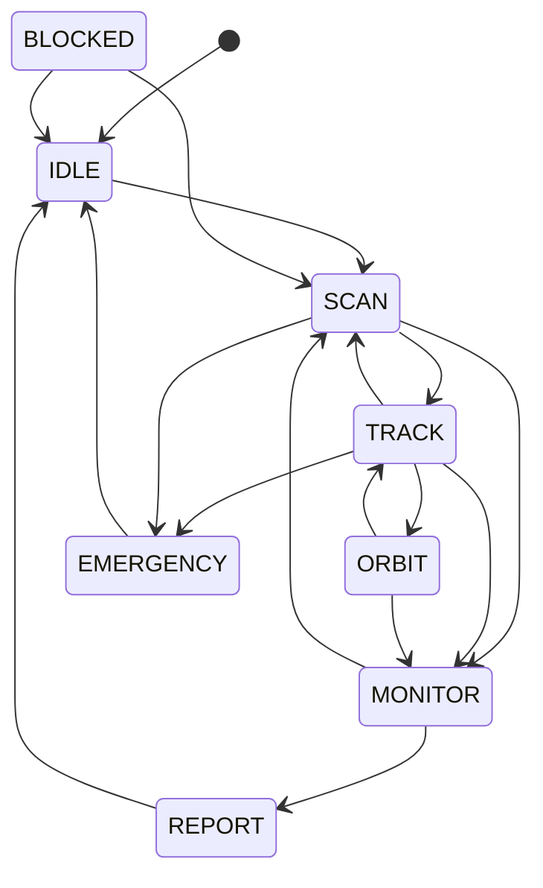

# Architecture Guide

This document provides an in-depth look at the SkyTrackVision system architecture, data flow, and design decisions.

## Layered Architecture

SkyTrackVision follows a strict **three-layer architecture** where each layer operates at a different frequency:



## Data Flow

### Per-Frame Pipeline

```
AirSim Camera → FramePacket → YOLOv8 → Detection[] → KalmanTracker → TrackedTarget
                                                                           ↓
AirSim Sensors → SensorSnapshot ─────────┬───→ SafetyEvaluator → SafetyEvaluation
                                          │                              ↓
                MissionFSM → MotionIntent → IBVS Controller → VelocityCmd → AirSim
```

### Contract Types

All data between layers flows through **typed dataclass contracts** defined in `autonomy/contracts.py`:

| Contract | Purpose |
|----------|---------|
| `FramePacket` | Camera frame with metadata |
| `Detection` | Single YOLO detection with class, bbox, track ID |
| `TrackedTarget` | Smoothed target with Kalman state, confirmation status |
| `SensorSnapshot` | LiDAR + proximity + telemetry at one point in time |
| `SafetyEvaluation` | Safety verdict: allowed directions, blocked reasons |
| `MotionIntent` | FSM output: what primitive to execute (FOLLOW, SCAN, HOVER) |
| `VelocityCmd` | Final velocity command sent to AirSim |
| `MissionContext` | High-level mission state for the LLM |
| `MissionReport` | End-of-mission telemetry summary |

## Mission FSM

The Finite State Machine is the **single source of truth** for mission state:



Invalid transitions raise `InvalidTransitionError`. The FSM includes timeout-based recovery: if a state exceeds its maximum duration, it auto-transitions to a safe fallback.

`EMERGENCY` is a **universal safe-abort state reachable from every other state** (only a few edges are drawn above to keep the diagram readable). It is entered either through the normal transition graph or, unconditionally, via `MissionFSM.emergency()` — which never raises, so an unattended mission can always reach a safe stop. The [Mission Watchdog](#mission-watchdog) is what drives the FSM into `EMERGENCY`.

## Mission Watchdog

While the `SafetyEvaluator` guards each *frame* against immediate hazards, the `MissionWatchdog` (`autonomy/watchdog.py`) guards the whole *mission envelope* for unattended flight. It is a pure function of telemetry and elapsed time, evaluated during `wait_seconds` and surfaced in `get_drone_status` as `mission_envelope`:

| Trigger | Condition | Effect |
|---------|-----------|--------|
| `battery` | battery fraction ≤ `battery_rtl_fraction` (when telemetry exposes it) | EMERGENCY |
| `timeout` | mission elapsed ≥ `max_mission_duration_s` (hard cap above the soft pilot timeout) | EMERGENCY |
| `altitude` | altitude above `max_altitude_m` ceiling | EMERGENCY |
| `geofence` | horizontal distance from home > `geofence_radius_m` | EMERGENCY |

On a trip the watchdog drives the FSM to `EMERGENCY`, commands a hover, and tells the LLM to terminate with `IDLE → request_land`. Limits are configured in `WatchdogConfig` (see `config/settings.py`) and overridable from `pilot.yaml`.

## Semantic Completion Verification

The pilot enforces both a **procedural** and a **semantic** completion gate. The procedural gate is the closing protocol (`REPORT → get_mission_report → request_land`). The semantic gate (`autonomy/mission_spec.py`) parses the natural-language task into measurable objectives and checks them against the final `MissionReport`:

```
"Find a truck, follow it for 30 seconds, then land"
  → observe(truck) AND duration(>=30s)
  → success iff protocol_ok AND unique_track_counts.truck >= 1 AND duration_s >= 30
```

A mission that runs the closing protocol but never accomplished the objective (e.g. landed without ever seeing a truck) is reported as `objectives_unmet`, not success. The parser is deterministic and conservative: a task with no measurable objective falls back to protocol-only completion, preserving prior behaviour. The derived criteria are also injected into the system prompt so the planner is scored against goals it can see.

## Safety Gate

The `SafetyEvaluator` is a **deterministic, non-overridable gate** between the control layer and AirSim:

```python
# This is enforced in AirSimBridge — the LLM cannot bypass it
evaluation = safety.evaluate(snapshot, connection_ok)
if not evaluation.allow_forward:
    cmd.vx = max(cmd.vx, 0)  # Block forward motion
if not evaluation.allow_descent:
    cmd.vz = max(cmd.vz, 0)  # Block descent
```

### Safety States

| State | Trigger | Effect |
|-------|---------|--------|
| `PATH_CLEAR` | All sensors nominal | No restrictions |
| `OBSTACLE_AHEAD` | Front proximity < threshold | Block forward movement |
| `OBSTACLE_CLUSTER` | LiDAR clusters > threshold | Block forward movement |
| `ALTITUDE_LOW` | Altitude < minimum | Block descent |
| `LANDING_CAUTION` | Low altitude during descent | Reduce descent speed |
| `SAFETY_OVERRIDE` | Connection lost / sensors unavailable | Block all movement |
| `REPOSITION_SUGGEST` | Marginal conditions | Suggest lateral reposition |

## IBVS Controller

The Image-Based Visual Servoing controller uses a **cascade PID** design:

```
                    ┌──────────────┐
 pixel error x ───→│  Yaw PID     │───→ yaw_rate
                    └──────────────┘
                    ┌──────────────┐     ┌──────────────┐
 area error   ───→ │  Forward PID │───→ │  Vx Inner PID │───→ vx
                    └──────────────┘     └──────────────┘
                    ┌──────────────┐     ┌──────────────┐
 pixel error y ───→│  Altitude PID│───→ │  Vz Inner PID │───→ vz
                    └──────────────┘     └──────────────┘
```

Features:
- **Derivative low-pass filter** — first-order IIR to suppress sensor noise
- **Anti-windup** — integral halved on error sign change to prevent overshoot
- **Output clamping** — configurable max velocities per axis

## LLM Tool Dispatch

The SkyPilot uses OpenAI function calling to control the drone. Available tools:

| Tool | Description |
|------|-------------|
| `get_scene_state` | Current frame class counts, registry summary, and target info |
| `get_target_info` | Details of the currently tracked target |
| `get_drone_status` | Altitude, telemetry, FSM state, elapsed time, and mission-envelope status |
| `get_mission_progress` | Per-objective acceptance status + envelope health (semantic completion) |
| `get_mission_report` | Cumulative mission report (unique counts, completion readiness) |
| `set_mission_state` | FSM transition with BFS path resolution |
| `request_takeoff` | Arm and take off |
| `request_land` | Land at current position (REPORT/IDLE only) |
| `request_move_to_altitude` | Move to a specific altitude |
| `request_scan` | Begin scanning (transition to SCAN) |
| `request_follow` | Lock and follow the target (transition to TRACK) |
| `request_hover` | Stop and hover in place |
| `request_return_home` | Return to the takeoff position |
| `wait_seconds` | Continue the current action for N seconds (watchdog-guarded) |

### BFS State Path Resolution

When the LLM requests a state that's not directly reachable (e.g., TRACK → REPORT), the `ToolDispatcher` uses BFS to find the shortest valid path through the FSM graph and executes each intermediate transition automatically.
